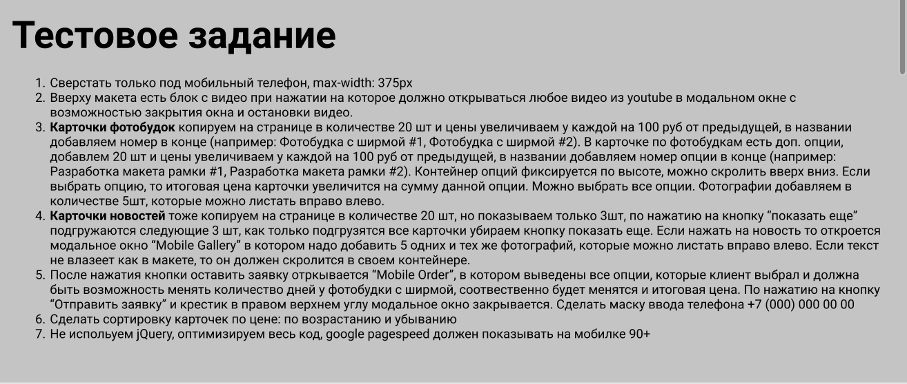

Сверстать только под мобильный телефон, max-width: 375px
Вверху макета есть блок с видео при нажатии на которое должно открываться любое видео из youtube в модальном окне с возможностью закрытия окна и остановки видео.
Карточки фотобудок копируем на странице в количестве 20 шт и цены увеличиваем у каждой на 100 руб от предыдущей, в названии добавляем номер в конце (например: Фотобудка с ширмой #1, Фотобудка с ширмой #2). В карточке по фотобудкам есть доп. опции, добавлем 20 шт и цены увеличиваем у каждой на 100 руб от предыдущей, в названии добавляем номер опции в конце (например: Разработка макета рамки #1, Разработка макета рамки #2). Контейнер опций фиксируется по высоте, можно скролить вверх вниз. Если выбрать опцию, то итоговая цена карточки увеличится на сумму данной опции. Можно выбрать все опции. Фотографии добавляем в количестве 5шт, которые можно листать вправо влево.
Карточки новостей тоже копируем на странице в количестве 20 шт, но показываем только 3шт, по нажатию на кнопку “показать еще” подгружаются следующие 3 шт, как только подгрузятся все карточки убираем кнопку показать еще. Если нажать на новость то откроется модальное окно “Mobile Gallery” в котором надо добавить 5 одних и тех же фотографий, которые можно листать вправо влево. Если текст не влазеет как в макете, то он должен скролится в своем контейнере.
После нажатия кнопки оставить заявку отркывается “Mobile Order”, в котором выведены все опции, которые клиент выбрал и должна быть возможность менять количество дней у фотобудки с ширмой, соотвественно будет менятся и итоговая цена. По нажатию на кнопку “Отправить заявку” и крестик в правом верхнем углу модальное окно закрывается. Сделать маску ввода телефона +7 (000) 000 00 00
Сделать сортировку карточек по цене: по возрастанию и убыванию
Не испольуем jQuery, оптимизируем весь код, google pagespeed должен показывать на мобилке 90+
​

https://inter-nine.vercel.app/
